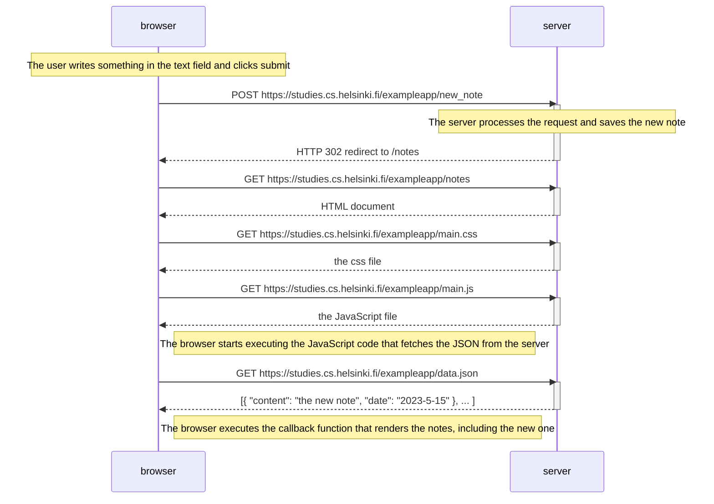

```mermaid
sequenceDiagram
    participant browser
    participant server

    Note over browser: The user writes something in the text field and clicks submit

    browser->>server: POST https://studies.cs.helsinki.fi/exampleapp/new_note
    activate server
    Note over server: The server processes the request and saves the new note

    server-->>browser: HTTP 302 redirect to /notes
    deactivate server

    browser->>server: GET https://studies.cs.helsinki.fi/exampleapp/notes
    activate server
    server-->>browser: HTML document
    deactivate server

    browser->>server: GET https://studies.cs.helsinki.fi/exampleapp/main.css
    activate server
    server-->>browser: the css file
    deactivate server

    browser->>server: GET https://studies.cs.helsinki.fi/exampleapp/main.js
    activate server
    server-->>browser: the JavaScript file
    deactivate server

    Note right of browser: The browser starts executing the JavaScript code that fetches the JSON from the server

    browser->>server: GET https://studies.cs.helsinki.fi/exampleapp/data.json
    activate server
    server-->>browser: [{ "content": "the new note", "date": "2023-5-15" }, ... ]
    deactivate server

    Note right of browser: The browser executes the callback function that renders the notes, including the new one
```
