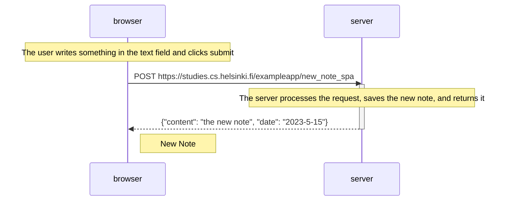

```mermaid
sequenceDiagram
    participant browser
    participant server

    Note over browser: The user writes something in the text field and clicks submit

    browser->>server: POST https://studies.cs.helsinki.fi/exampleapp/new_note_spa
    activate server
    Note over server: The server processes the request, saves the new note, and returns it

    server-->>browser: {"content": "the new note", "date": "2023-5-15"}
    deactivate server

    Note right of browser: New Note
```